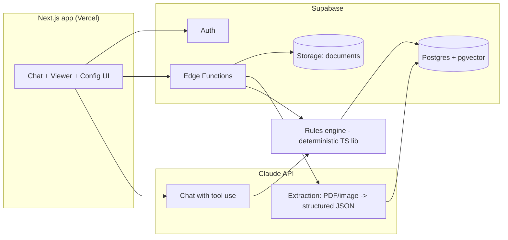

# Proposal — Web Interface for Waste Acceptance & Compliance ("Anna")

**Audience:** plant owner / operator of an Italian waste-treatment facility
**Reference design:** the "Valli SPA AI — Chat con Anna" mock-up (chat assistant + document viewer + compliance verdict)
**Date:** 2026-07-26 · **Status:** draft for review

---

## 1. What the product does

The operator receives analytical reports (*rapporti di prova*) from customers who want to deliver waste. Today the acceptance decision — "can we take this waste, on which line, and what can we make of it?" — is manual: read the PDF, find the right limit table, compare 20–30 parameters, write up the outcome.

The product automates that loop while keeping the operator in control:

1. **Upload** a lab report (PDF, Excel, scan/image).
2. **Extraction** — the system reads the report and extracts: EER/CER code, waste description, sampling & report dates, laboratory, digestion/analytical methods, and the full parameter table (analyte, result, unit, method). Extracted data is shown in an editable panel (*"Dati estratti" → Modifica*) so the operator can correct OCR/interpretation errors before anything is decided.
3. **Compliance check** — a deterministic rules engine compares each parameter against a **versioned regulatory limit table** selected by the operator or suggested by the system (e.g. *Tabella 5, colonna A* for a Soil Washing line targeting End of Waste). Output: per-parameter verdict (conforme / non conforme / non determinato) and an overall conclusion, exactly as in the mock-up.
4. **Decision support** — acceptance verdict per plant line, suggested destination (recovery line, landfill class, external destination), and a written conclusion citing the norms applied.
5. **Chat** — the operator can ask follow-up questions in natural language ("e se lo confrontiamo con la colonna B?", "quali parametri mancano per l'omologa?") with the document and the plant's authorization as context.
6. **Records** — every verification is stored with document, extracted data, limit-table version, and verdict → an audit trail usable toward ARPA/authority inspections.

### A design principle worth stating up front

**The AI extracts and explains; it never computes conformity.** The comparison "1,2 mg/kg > 1 mg/kg → non conforme" is done by a deterministic rules engine over versioned limit tables stored in the database. This matters because:

- the verdict must be **reproducible and auditable** (same input → same output, always);
- limit tables change with legislation — versioning them as data means updates don't require redeployment and past verdicts remain traceable to the table version used;
- hallucinated limits in a regulatory context are unacceptable; the LLM's failure modes are confined to extraction, where the human-review step catches them.

---

## 2. Domain model (Italian waste-regulation context)

The rules engine and data model are built around these concepts. Exact table encodings will be validated with the customer's environmental engineer before go-live — the screenshot references "Tabella 5 del D.Lgs. 121/2020, colonna A", and the engine is designed so any such table is just data.

| Concept | Notes |
|---|---|
| **EER/CER code** | 6-digit European Waste Catalogue code, `*` = hazardous (e.g. `17 09 03*` vs. its mirror `17 09 04`). Mirror-code logic (hazardous vs. non-hazardous entry depending on dangerous-substance content, HP1–HP15 per Reg. (EU) 1357/2014) is part of classification support. |
| **Limit tables** | Examples the engine must host: CSC Tab. 1 All. 5 Parte IV D.Lgs. 152/2006 (col. A verde/residenziale, col. B commerciale/industriale); landfill acceptance criteria per D.Lgs. 121/2020 (eluate + totals, per landfill class); DPR 120/2017 (terre e rocce da scavo); DM 05/02/1998 (recupero non pericolosi); End-of-Waste criteria per line; **plant-specific AIA/authorization limits**, which often override or narrow national tables. |
| **Plant lines** | Each treatment line (Soil Washing, inertization, biological, storage D15/R13…) has: admissible EER codes, applicable limit set(s), target output (EoW aggregate, landfill, recovery). Acceptance is always evaluated *per line*. |
| **Total vs. eluate** | Reports contain totals (mg/kg s.s.) and leaching-test results (mg/l, UNI EN 12457-2). Landfill criteria are mostly on eluate; CSC/EoW mostly on totals. The engine must distinguish the two and flag when a required determination is missing (*"non determinato"* — 3 of 23 in the mock-up). |
| **Omologa** | The periodic waste-characterization/homologation cycle between producer and plant: first full characterization, then per-delivery conformity checks with expiry dates. A natural Phase-2 feature. |
| **RENTRI** | Italy's digital waste-tracking registry (DM 59/2023, mandatory since 2025: registri and FIR digitale). Not in scope for the MVP, but the data model keeps producer/transport/movement entities compatible with a later RENTRI integration. |

⚠️ **Open input:** the two Gemini chat links provided as context are not reachable from this environment (the network policy blocks `gemini.google.com`). Any requirements captured there — specific tables, thresholds, workflows — need to be pasted into the repo (e.g. `docs/context/`) or into a session message; the proposal will be reconciled with them.

---

## 3. Screens (mirroring the mock-up)

1. **Chat con Anna** — chat with attachment support; assistant answers include structured blocks (inquadramento, esito conformità table, conclusione) rendered as components, not free text.
2. **Document viewer side panel** — PDF viewer with highlighted non-conform rows, plus panels: *Dati estratti* (editable), *Confronto* (selected limit table, normativa, target line — all switchable via *Cambia*), *Allegati nella conversazione*.
3. **I miei documenti** — document library with extraction status, linked verifications, expiry (for omologhe).
4. **Analisi e confronti** — list of all verifications; re-run against a different table; export PDF report of the esito.
5. **Impianti e linee** — plant configuration: lines, admissible EER codes, limit-set bindings, authorization data.
6. **Normativa e procedure** — searchable normative library (RAG over ingested norm texts and internal procedures) powering chat citations.
7. **Storico richieste** — audit trail: who verified what, when, against which table version, with which manual corrections.

Language: **Italian UI** (i18n framework from day one; English as secondary locale).

---

## 4. Architecture



- **Frontend:** Next.js (App Router) + TypeScript + Tailwind, deployed on **Vercel**. Server components for lists/config, client components for chat and the PDF viewer (`pdf.js` with bbox highlights of non-conform rows).
- **Backend:** **Supabase** — Postgres (with **Row Level Security** for multi-tenant isolation per organization), Auth, Storage for uploaded documents, Edge Functions for the ingestion pipeline. (Both platforms are already connected to this workspace.)
- **AI layer:** Claude API.
  - *Extraction:* the PDF is sent to Claude with a strict JSON schema (structured output) for the report fields and parameter rows; per-field confidence + source-page reference; low-confidence fields are flagged in the *Dati estratti* panel for human confirmation.
  - *Chat:* Claude with **tool use** — its tools are `run_comparison(analysis_id, limit_table_id)`, `search_normativa(query)`, `get_plant_config()`, etc. So when the user asks "verifica contro Tabella 5 colonna B", the model calls the deterministic engine and formats the result; it never invents numbers.
- **Rules engine:** pure TypeScript library, unit-tested against hand-verified fixtures. Handles: unit normalization (mg/kg s.s., mg/l, µg/kg…), `<` (below-LOQ) semantics — a result of `< 10` vs. a limit of `10` is conforme, LOQ above the limit is *non determinato* — missing mandatory parameters, and sum-rules (e.g. sommatoria IPA, PCB).
- **Normativa RAG:** norm texts chunked into pgvector; chat citations always point to the stored source passage.

### Core data model

```
organizations ─< users
organizations ─< plants ─< plant_lines ─< line_limit_bindings >─ limit_tables ─< limit_entries
organizations ─< producers (customers)
producers ─< documents (storage ref, type, status)
documents ─< analyses (extracted header: EER, dates, lab, method, confidence)
analyses ─< analysis_parameters (analyte, result, operator </=, unit, method, basis: total|eluate)
analyses ─< verifications (limit_table_version, line, per-param verdicts JSON, overall esito, decided_by, decided_at)
conversations ─< messages (role, content blocks, attachment refs, tool calls)
audit_log (append-only: every edit to extracted data, every verdict)
```

`limit_tables` are versioned (`valid_from`, `valid_to`, `source_ref` citing the norm article) and seeded via reviewed migration files — never edited free-hand in production.

---

## 5. Delivery plan

**Phase 1 — MVP (the screenshot, end-to-end):**
auth + org setup · document upload → extraction → editable *Dati estratti* · rules engine + 2–3 seeded limit tables (the ones the plant actually uses, validated with the customer) · comparison UI with per-parameter esito and conclusion · chat over the active document · verification history. *Acceptance test: the `17 09 03*` sample report from the mock-up reproduces the exact verdict (18 conformi / 2 non conformi — Mercurio, Zinco / 3 non determinati).*

**Phase 2 — plant operations:**
Impianti e linee configuration UI · line suggestion ("quale linea può accettarlo?") · omologa lifecycle with expiries · PDF export of the esito di conformità · Normativa RAG + Storico richieste.

**Phase 3 — integrations & scale:**
customer-facing upload portal (producers submit reports themselves) · RENTRI / FIR digitale integration · weighbridge/LIMS import · multi-plant analytics dashboard.

Each phase ships deployable; Phase 1 is the review gate for the whole design.

---

## 6. Open questions for the owner

1. **Gemini context** — please export/paste the two Gemini conversations (links are blocked from this environment) so their requirements can be folded in.
2. **Which limit tables and lines** does the plant actually operate with (AIA authorization extract would be ideal)? These become the Phase-1 seed data.
3. **Users & tenancy** — single plant or multiple sites? Do customers (producers) get logins in Phase 1 or only internal staff?
4. **Report formats** — a sample set of real lab reports (the 3–5 labs most customers use) is needed to tune extraction before go-live.
